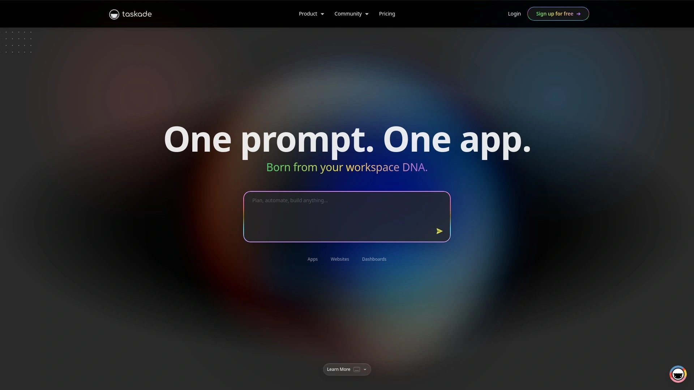
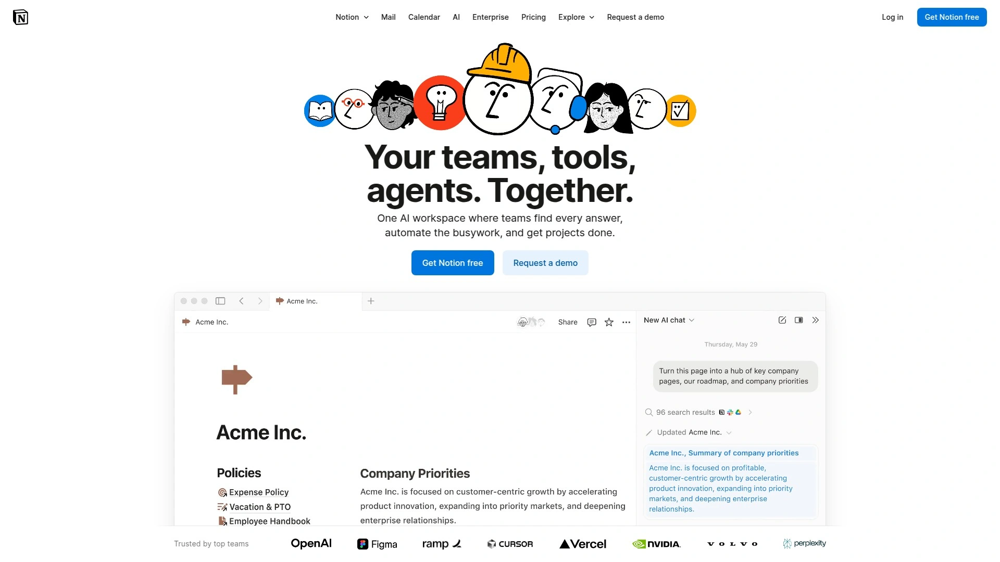
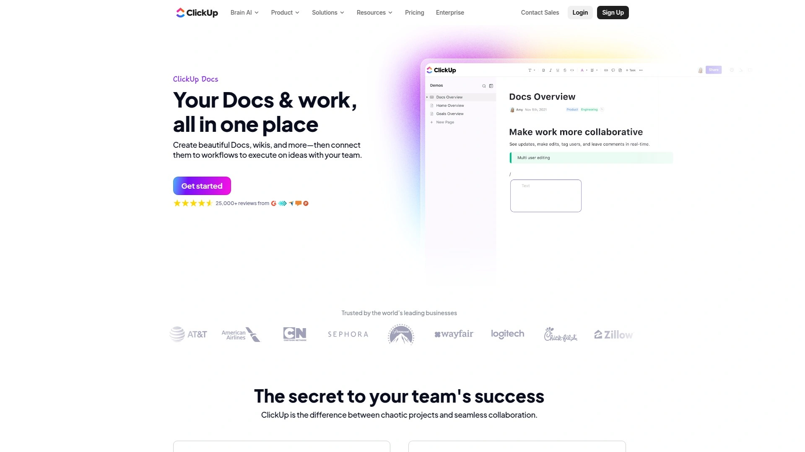
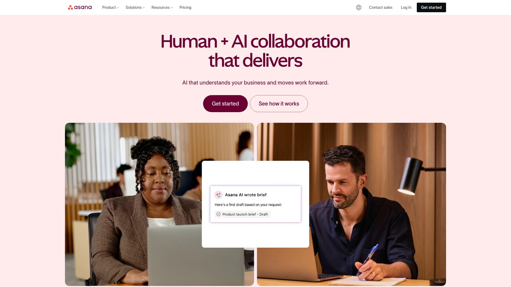
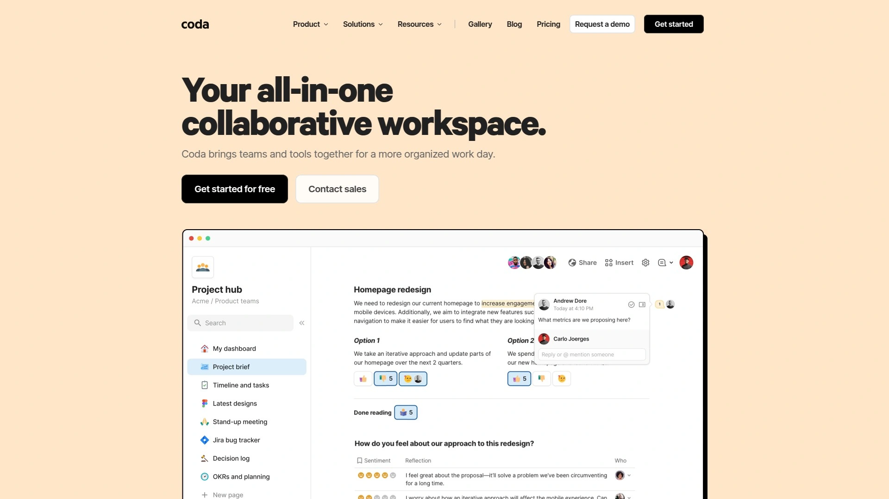
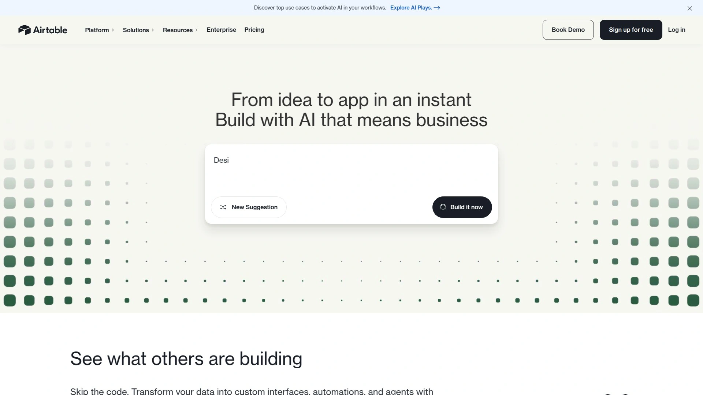
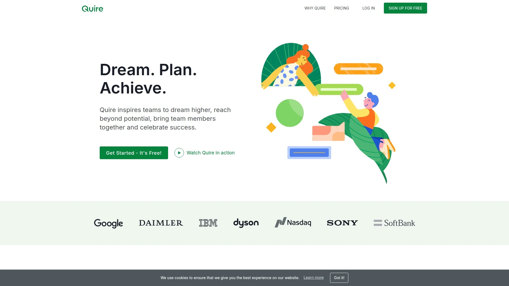
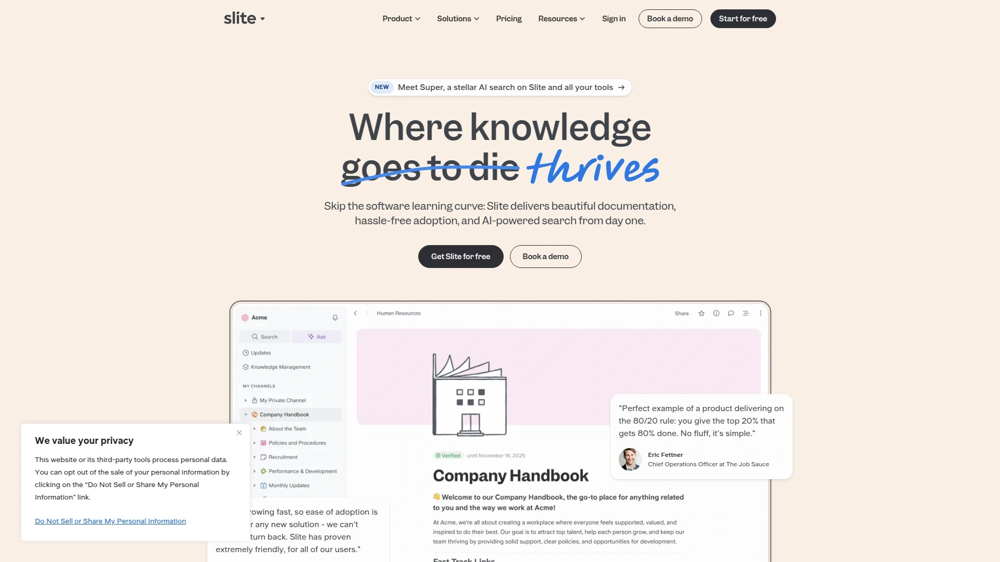
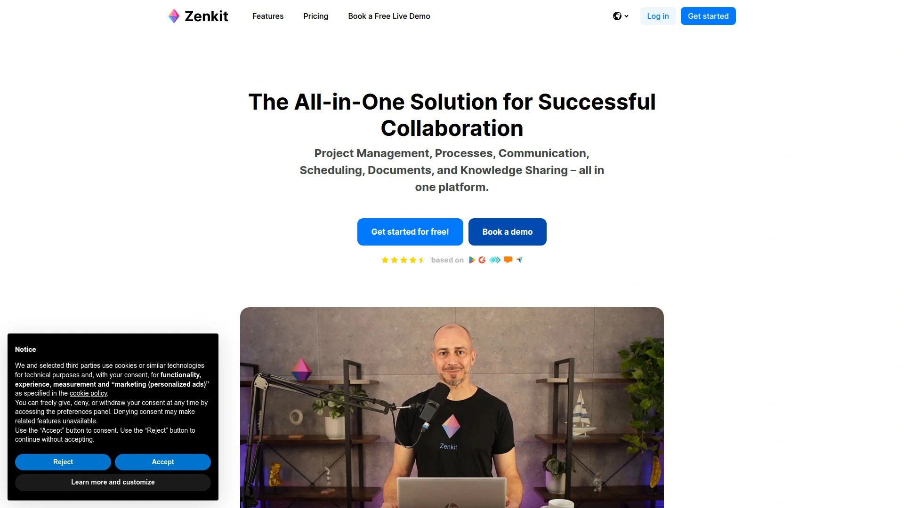

# Top 13 AI Productivity Tools in 2025 (Latest Updated)

Managing modern work isn’t about being busier—it’s about being smarter with your time. Teams crave tools that simplify workflows and blend note-taking, project tracking, and collaboration into one smooth experience. Whether you’re a startup founder or a freelancer tired of browser tab chaos, AI-powered productivity tools offer faster task completion, more reliable organization, and wider integration coverage.

## [Taskade](https://taskade.com)

Taskade stands out as a unified workspace, blending notes, mind maps, and collaborative task lists in real time—great for fast-moving teams or creators who hate switching between apps.

Its core features include multi-device sync, visual project boards, and live chat/video built right in, so you can brainstorm and execute ideas without losing flow. AI-powered content generation, smart task automations, and flexible templates make launching new projects quick. Designed for both individuals and remote teams, Taskade keeps onboarding simple—drag, drop, and organize with almost zero learning curve. The cost structure suits both solo users and growing businesses.

## [Notion](https://www.notion.so)

Notion delivers ultimate flexibility with all-in-one docs, databases, and wikis, perfect for those who want their workspace to adapt to how they think and work.

Users can build knowledge bases, design project dashboards, or manage daily tasks with modular blocks. Fast search, customizable templates, and new AI features like writing helpers and smart summaries speed up workflows. The interface is clean, and most users can create their system in an afternoon. Regular updates and solid integration with third-party apps keep this platform improving all the time.

## [ClickUp](https://clickup.com)

ClickUp is a powerhouse for companies scaling up—from startups to enterprises—blending project management, docs, and chat in one space.

Its core advantage is customization: every workflow and task view can be tailored. Automations save time on repetitive work, and built-in goal tracking keeps teams on the same page. Advanced AI tools help with reporting and task sorting, while onboarding resources make it easy for new members. ClickUp’s interface feels buzzy but approachable, adapting well from solo hustlers to large teams.

## [Trello](https://trello.com)

Trello shines with its simplicity, using Kanban boards to organize projects visually. Great for creatives, educators, and managers juggling multiple objectives.

Drag-and-drop cards, color-coded labels, and Power-Ups (mini integrations) make it as simple or deep as needed. Trello AI now recommends optimizations and automates board actions. Fast learning curve—most teams are up and running in minutes. Trello’s mobile app and web version sync seamlessly for on-the-go task updates.

## [Asana](https://asana.com)

Asana streamlines teamwork for groups focused on deadlines and progress tracking, mixing task lists, timelines, and automation.

AI-driven project briefs and smart scheduling keep projects moving. Advanced reporting reveals bottlenecks before they cause trouble. Asana adapts to marketing teams, tech squads, and even nonprofits with its versatile templates. The onboarding journey is beginner-friendly, and pricing matches every stage of growth.

## [Monday.com](https://monday.com)

Monday.com is built for teams that love dashboards. Its visual project boards mix colorful charts, status updates, and workload overviews, all boosted by AI suggestions for better productivity.

Users can automate time tracking, assign owners, and build custom workflows for any department—from HR to product development. Integrations cover dozens of popular business tools. The fast drag-and-drop interface means less setup, more doing.

## [Coda](https://coda.io)

Coda fuses docs, spreadsheets, and apps—perfect for people who hate silos. One tool, endless customization.

AI blocks supercharge writing and data management, while Packs connect to tools like Slack, Jira, and more. Coda adapts for solo planners, small teams, and complex organizations. Templates speed up builds, and the support library is packed with creative community solutions.

## [Airtable](https://airtable.com)

Airtable brings together the best of spreadsheets and databases, making it easy to organize anything—from content calendars to inventory—without technical expertise.

Its AI tools automate sorting, tagging, and data enrichment. Views include grids, calendars, and Kanban boards, with plenty of templates for quick launches. Flexible pricing covers individuals and big teams.

## [Quire](https://quire.io)

Quire is about lightweight, distraction-free task management—nested task trees keep even the biggest projects tidy.

The interface stays clean, with no clutter to slow you down. Collaboration tools include comments and integrated file attachments. Recent AI features suggest due dates and auto-prioritize urgent tasks. Onboarding is a breeze.

## [Slite](https://slite.com)

Slite helps teams document everything—meetings, processes, or centralized knowledge—using streamlined collaborative notes.

AI-powered search and drafts make information discovery fast. Integrates with popular chat tools for real-time updates. Templates streamline internal communication for consistent results.

## [Zenkit](https://zenkit.com)

Zenkit offers modular productivity—switch between mind maps, Kanban, tables, or calendars with instant data sync.

AI features help tag, sort, and prioritize tasks. The tool fits unique workflows, whether you’re managing research or sales pipelines. Simple setup with robust API options for power users.

## [Nimbus Platform](https://nimbusweb.me)

Nimbus Platform lets users capture, organize, and share knowledge—think web clippers, notes, and team workspaces in one.

AI boosts search and automates repetitive note structuring. Suited for educators, teams, and anyone needing detailed documentation. Very intuitive for beginners, with strong mobile app support.

## [ClickUp Docs](https://clickup.com/docs/)

ClickUp Docs (a branch of ClickUp) focuses on collaborative document creation linked to tasks and projects.

Real-time collaboration, AI writing assistance, and document linking make working smoother. Integrated into ClickUp’s larger ecosystem, Docs allows for seamless transition from planning to execution.

***

### FAQ

**Q: How do I quickly start using these AI productivity tools?**
A: Sign up, select a template or workspace that fits your workflow, and begin organizing your first project—most platforms offer guided tours.

**Q: Can these tools integrate with my existing apps?**
A: Many popular AI productivity platforms support integration with calendars, email, file storage, and more—check each platform’s integration page for details.

**Q: How do I measure the actual effectiveness of a platform?**
A: Use trial versions to track time saved, project completion speed, and team feedback over a few weeks—then compare results.

***

Ready to streamline your work in 2025? These thirteen AI productivity solutions are built for real-world teams who want bigger results with less clutter. For those seeking an all-in-one answer, [Taskade](https://taskade.com) shines thanks to its blend of simplicity, automation, and collaboration—ideal for fast-moving creators and teams aiming for less friction, more flow.
